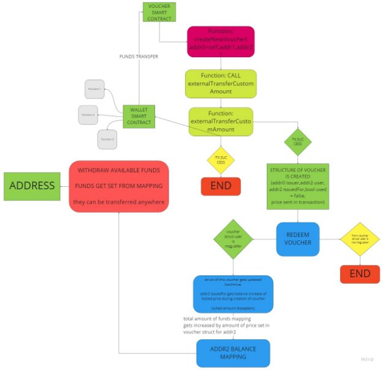

# **BLOCKCHAIN PROOF-OF-CONCEPT PROPOSAL**

***Blockchain Development individual assignment.*** 

**Party of 3 – Fix for : Cash flow, Trust and transparency** 

**Prepared by: [Giorgi Bazierashvili]**

# **SUMMARY**
physically going to offices or providerds to get a voucher and then going to the stores to redeem them is tideous right? Well no more thanks  to the blockchain technology, this approach can also be used for health insurance providers, manufacturers and all the systems that involve 3 parties with one of them being the transmitter of the value a middle man if you will.

## **The Solution**
- General benefit 1: easy digital solution to cover a bigger market.
- General benefit 2: no trust issues, no trust needed at all.
- General benefit 3: better cash flow for businesses.
- General benefit 4: no need for high cost centralized systems.
- General benefit 5: more profit, less spending.
-

# **THE BLOCKCHAIN SOLUTION**
## **Smart contracts specification**

See comments in SC.sol file for additional information.

contract UsersWallet{

`    `address owner;

`    `uint256 starterIndex = 0;

`    `address[] contractUsers;

`    `mapping (address=>uint256) addressBalances;

`    `mapping(address =>uint256) addressIndexInArrayToSaveGas;

`    `event fundsReceived (string status, uint256 amount);

`    `event fundsTransferred (string message,address toAddress, uint256 amount);

`    `constructor(){

`        `owner = msg.sender;

`    `}

`    `modifier onlyOwner(){

`        `require(tx.origin==owner,"You're not the owner of this smart contract!");

`        `\_;

`    `}

function createNewUser()internal {}

function getFunds() public payable{}

function checkBalanceOf(address \_address)external view returns(uint256){}

function deleteFromArrayIfNoFunds()internal{}

function externalTransferCustomAmount(address receiverAddress, uint256 amount)external {}

function externalTransferAllAmount(address receiverAddress) external returns(uint256 allFunds){}

function transferCustomAmount(address receiverAddress, uint256 amount)public {}

function transferAllAmount(address receiverAddress) public{}

function getArray()public view onlyOwner returns( address[] memory){}

fallback() external payable {}

receive() external payable {}

contract Voucher{

address owner;

`    `address private  thisContractAddress;

`    `uint256 public idCounter = 0 ; 

`    `UsersWallet private usersWallet;

`    `mapping(uint256 => voucherStruct) voucherMapping;

`    `mapping(address => uint256) totalAmount;

`    `mapping(address => uint256) totalFrozenAmount;

`    `struct  voucherStruct {

`    `address issuer;

`    `address recipient;

`    `address finalDestination;

`    `string voucherDetails;

`    `uint256 price;

`    `bool used;

`    `}

`    `event voucherWasIssued(uint256 idOfVoucher, address from, address userId, address destination,string message, uint256 funds);

`    `event moneyIsDeposited(address  userAddr, uint256 amount);

`    `event voucherRedeemed(address redeemer, address redeemedFor, string message, uint256 amount);

constructor (address walletsContractAddress){

`        `usersWallet = UsersWallet(payable(walletsContractAddress));

`        `thisContractAddress = address(this);

`        `owner = msg.sender;

`    `}

`     `modifier onlyOwner(){

`        `require(tx.origin==owner,"You're not the owner of this smart contract!");

`        `\_;

`    `}

`    `modifier notNegative(){

`        `require((totalAmount[msg.sender]-totalFrozenAmount[msg.sender])>=0,"Your NET balance is negative!");

`        `\_;

`    `}

function issueVoucher(address \_userOfVoucher, address \_redeemerCompany, uint256 \_funds, string calldata details)public{}

function redeemVoucher(uint256 id)public {}

function checkAmountInWallett(address \_balanceOf)public view returns(uint256){}

function callTransferCustomAmount(uint256  amount)internal {}

function getVoucher(uint256 id)public view returns(voucherStruct memory){}

function getVoucherDetails(uint256 id)public view returns(address from,address recipient, address voucherFor, string  memory details, uint256 price,bool used){}

function checkMyBalances()public view returns(uint256 \_totalFunds,uint256 \_frozenFunds){}

function getAvailableFunds()public view notNegative returns(uint256){}

function withdrawAllAvailableAmount(address whereTo)public notNegative{}

function withdrawCustomAmount(address whereTo,uint256 amount)public{}

function generalCallGetArray(address \_addr)public returns(bool success, bytes memory payload){}

fallback() external payable {}

receive() external payable {}

## **Smart contracts explanation**
- Contract1 also know as UsersWallet contract is used for being a wallet for our users on top of which we have build voucher system, furthermore it can be developed for more use cases (depends on what our Fin managers decide) this implies ease of adoption of new projects for our users – because they already have funds on our secure wallet system.
- Contract2 is used 3 way voucher lifecycle:

Side 1 : issuer

Side 2: transmitter (user)

Side 3: accepting party(final destination)

Side1 issues contract with specific amount of funds, these funds are then locked in the contract system and only way for them to be unlocked is via a transaction from Side2 (user), the redeem function will automatically release all the funds locked in the voucher to Side 3 accepting party.
## **Smart contracts process flow**

**Example Flowchart 1**. Logical cycle of the two smart contracts

In above picture it is explained how the createNewVoucher function interacts with whole lifecycle of two smart contracts, for this to work firstly we need to have funds available on the walletSmart contract, then we create new voucher struct define the fields set the price of the voucher and deploy it, if transaction was successful the price we set earlier will be sent to the voucher SC and will be frozen, if user address calls redeem voucher function funds will be released for finalDestinationAddress, then finalDestination address owner can transfer it anywhere he/she pleases / If this project gets accepted by the management additional functionality will be added such as reinvesting the funds from the Vouchers SC contract – stableCoin connection for more stability and so on… 
# **EXPECTED BUSINESS RESULTS**

We expect our proposed solution to our Client’s Company’s requirements to provide the following results:
## **Technical Benefits**
- No costs of maintaining expensive centralized systems, no need for physical documents
- No (redacted) employees – less points of failure.
- No centralization – no single point of failure.
- No hackers and data breaches\* (in case of the consortium network)
- No double spending! – distributed ledger ensures this 
- No forgery – code is law
## **Other Benefits**
- Result 1. Transparency – it is self implicit
- Result 2. No trust issues where trust is not needed.
# **CONCLUSION**

Thus including all the technical and business side of things, its easy to come to a profound solution that implementing this trustless 3 party smart contract architecture is the best choice right now for any sector may it be(insurance, guarantee services, or so on).

SC will ensure more stability Less expenses for all parties involved. no need for additional human capital and again less expenses, easier tracking of the transactions between branches and economic gain as well as transparency and a chance to dominate the market with this approach.
